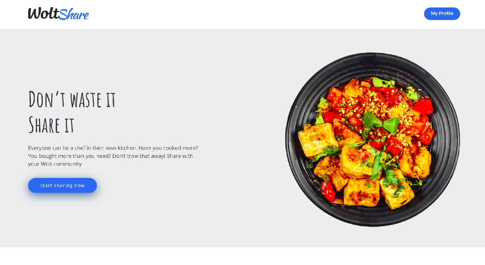
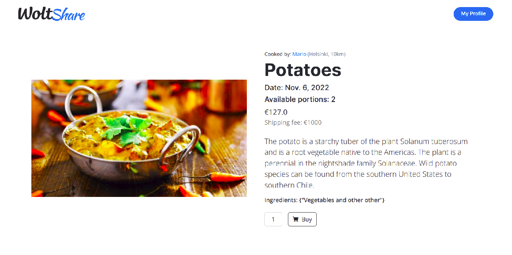
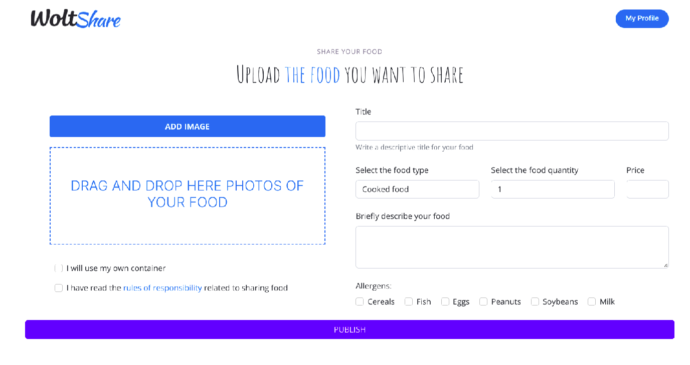
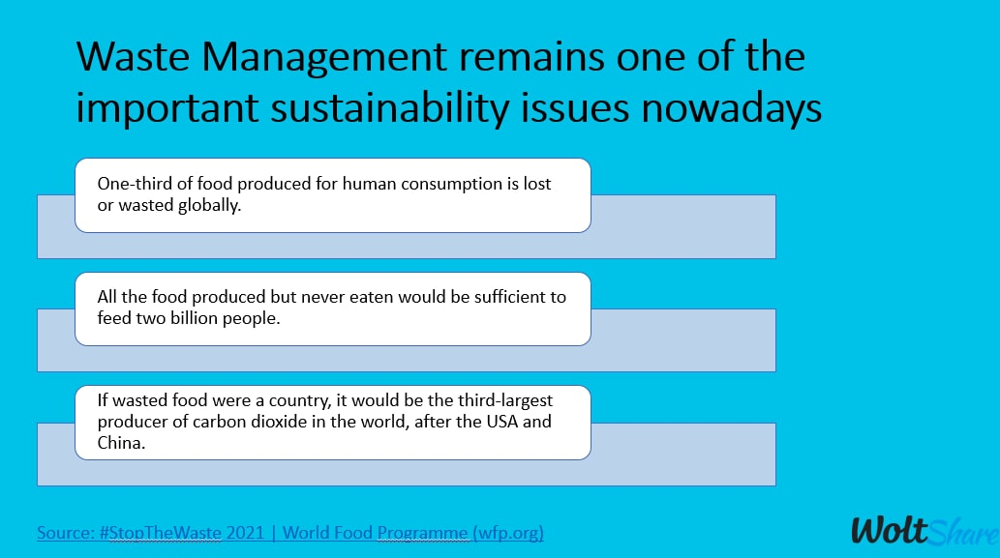
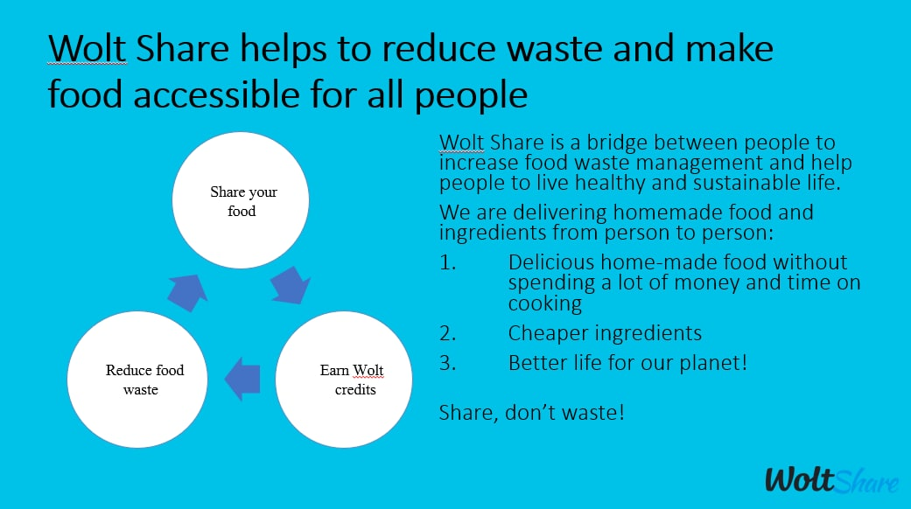
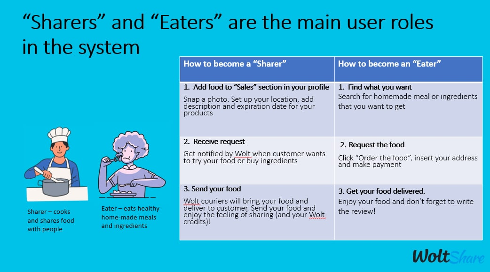

# WoltShare
Wolt Green Share project for 2022 Junction hackaton (4-6.11.2022)

Challenge: **Wolt**\
**Better Cities. Delivered.**

Participants:
- Marco DiFrancesco
- József-Hunor Jánosi
- Fatmakhanim Mammadova
- Giacomo Mutti
. Sibilla Silbano

---
The website connects people who have leftover food with hungry people by bringing Wolt drivers to them.

The Django based application lets people post title, images, and description about food that they do not like to consume but rather sell or give away. On the website people can browse through the available food selections, and order and pay for it. Afterwards, through the help of the Wolt Drive API, Wolt drivers are sent to deliver the abovementioned foods from door to door.

Screenshots of the website:

---

Little about our motivation and why did this projects:

